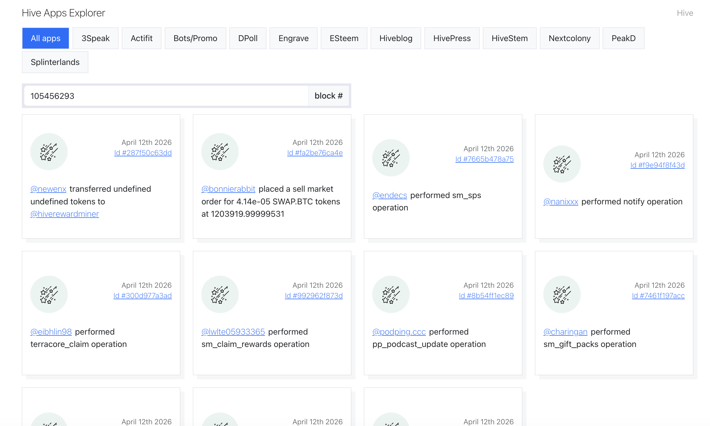

# Hive Apps Explorer

Hive Apps Explorer is a blockchain explorer for Hive dapps.



## Setup
```
npm install
```

### Config
Please add the following api endpoints to your .env file (root folder):
```
VITE_HIVE_MAINNET = 'https://api.openhive.network'
VITE_STEEMENGINE_API = 'https://api.steem-engine.com/rpc'
```


### Running a project
```
npm run dev
```

### Building a project
```
npm run build
```