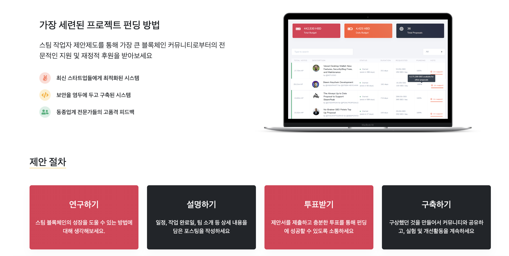

# Hive DAO

Hive DAO is a governance/proposal system for Hive blockchain.



## Setup
```
npm install
```

### Config
Please add the following api endpoints to your .env file (root folder):
```
VUE_APP_HIVE_MAINNET = https://api.openhive.network
```

## Running a project
```
npm run dev
```

### Building a project
```
npm run build
```
