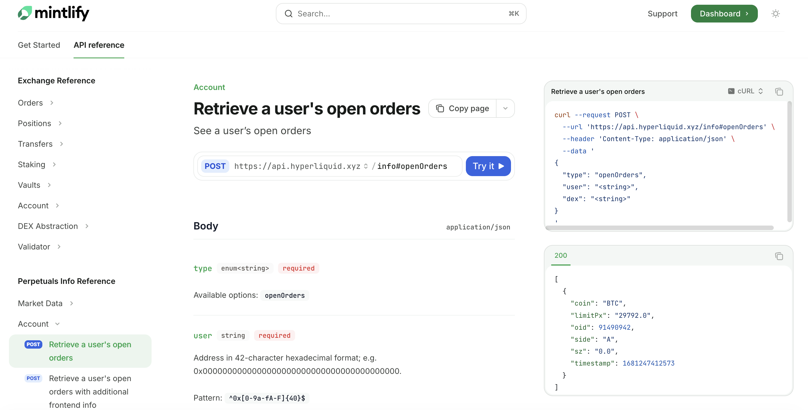
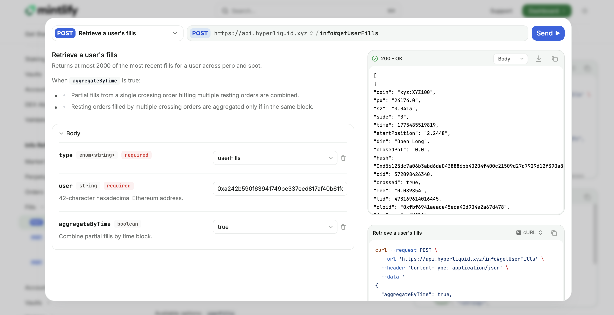

# Overview

[Hyperliquid](https://hyperliquid.gitbook.io/hyperliquid-docs) API documentation, optimized for OpenAPI and Mintlify.

Note:
- Some of the endpoints of the OpenAPI references could be significantly improved and simplified. The goal of the project was to simply migrate to a new format.
- This project will not be supported or maintained. This is for testing purposes of the Mintlify platform.





## Setup

Install the [Mintlify CLI](https://www.npmjs.com/package/mint) to preview your documentation changes locally. To install, use the following command:

```
npm i -g mint
```

Run the following command at the root of your documentation, where your `docs.json` is located:

```
mint dev
```

View your local preview at `http://localhost:3000`.

## Prompting

Below is the prompt that I used to convert a markdown API into an OpenAPI schema. This approach should work consistently without any major issues.

```md
Convert the provided Markdown API reference into a valid OpenAPI 3.1.0 YAML file targeting Mintlify documentation platform.

---

## Structure

- One file, `openapi: 3.1.0`, with `info`, `servers`, `tags`, `paths`, `components/schemas`.
- All operations share the same URL and HTTP method. Use path fragments for unique keys: `/info#operationName`. The fragment is ignored at runtime.
- `operationId`: camelCase derived from the endpoint name.
- `summary`: copied verbatim from the `##` heading.
- `tags`: group operations into logical sections.
- Response schemas → named `components/schemas` entries, referenced via `$ref`. Use `oneOf`/`allOf` for discriminated variants.
- Path order must match the Markdown heading order exactly.

## Fidelity

- Copy every `summary` verbatim.
- Keep `description` fields as prose.
- Preserve inline comments from response examples (e.g. `// this is optional`) as `x-comment` on the relevant schema property.
- Deprecated endpoints: set `deprecated: true` with the deprecation note in `description`.
- Include at least one `example` on each request body; use named `examples` on responses where the docs show multiple tabs.

## Mintlify YAML

- Quote **all** string values inside `example:` and `value:` blocks. Numbers, booleans, and `null` stay bare. Everything else gets `"..."`. No exceptions.
- Never use `>-` or `|` inside example blocks.
- Use flow notation (`[{...}]`) for arrays-of-arrays in examples.
- Use `|` (literal block scalar) for multiline `description` fields.
- Schema `description` with colons or quotes → single-quote: `description: '"A" = ask/sell'`.

## Generation

Write and run a Python script using PyYAML with a custom `SafeDumper` that double-quotes all `str` values. Dump with `default_flow_style=False, sort_keys=False`. Then validate:

1. Parse with `yaml.safe_load`.
2. Print every `operationId` + `summary` pair and confirm they match source headings.
3. Assert every value inside `example:`/`value:` blocks is a number, boolean, `null`, or quoted string.
```